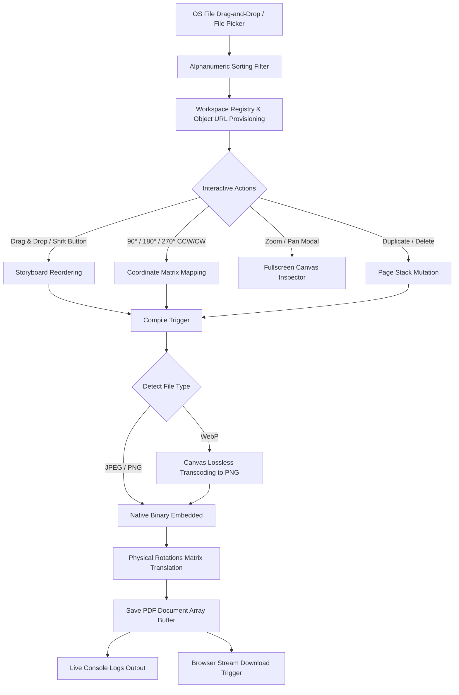

# 📄 OptiMerge Studio — Lossless Client-Side Page Compiler

[](https://react.dev/)
[](https://vite.dev/)
[](https://pdf-lib.js.org/)
[](https://opensource.org/licenses/MIT)
[](https://amallal2004.github.io/OptiMerge/)

**OptiMerge Studio** is a premium, client-side, zero-compression image-to-PDF compilation sandbox. Engineered with a "local-first" privacy model, it empowers users to arrange, inspect, rotate, and combine high-resolution images (JPEG, PNG, WebP) into pristine, structurally-sound PDF documents. **Not a single byte of your data ever leaves your browser.**

---

## ✨ Core Pillars & Key Features

### 🔒 1. 100% Client-Side Private Sandbox
* **Zero Server Uploads**: Traditional PDF converters upload your confidential images to remote servers, exposing you to privacy leaks. OptiMerge operates entirely inside a client-side JavaScript stream.
* **Instant Processing**: Because everything runs in the browser, file reading, transcoding, and merging are bound only by your hardware's CPU speed—no network bottlenecking.

### 📐 2. Zero-Compression Preservation Engine
* **Untouched Bitstreams**: JPEGs and PNGs are embedded natively using low-level binary streams via `pdf-lib` without any pixel decompression or re-compression. Original pixel grids, metadata ratios, and colors remain exactly as they were captured.
* **Lossless WebP Transcoding**: WebP files (which aren't natively supported by standard PDF decoders) are transcoded losslessly on-the-fly into raw PNG bitstreams using dynamic client-side Canvas buffers.

### 🔄 3. Spatial Coordinate Rotation Engine
* **Physical Matrix Mapping**: Unlike simple CSS-only rotation hacks, OptiMerge recalculates the actual physical spatial layout matrices of the image on the PDF canvas.
* **Aspect Ratio Awareness**: If you rotate an image by 90° or 270°, the physical PDF page dimensions dynamically swap (`Page Width = Image Height`, `Page Height = Image Width`) and the canvas mapping matrix is rotated, guaranteeing that your text remains uncropped and crisp.

### 🔬 4. Advanced Inspection & Control Board
* **HTML5 Storyboard Grid**: Drag-and-drop workspace cards with real-time thumbnail animations to seamlessly order your document spreads.
* **PDF Flow View**: A scrollable vertical canvas simulating the compiled document flow page-by-page.
* **Micro-Interactive Zoom & Pan**: An advanced fullscreen modal supporting mouse wheel scrolling (from `40%` to `400%` scale) and physical mouse drag-to-pan tracking to examine high-resolution scans for fine text readability.
* **One-Click Smart Sorting**: Organize your pages instantly by filename (alphanumerically), file size (smallest/largest), physical dimensions (largest), or randomize them.

### 📟 5. Live Developer Console
* **Real-time Compilation Logs**: A beautiful, color-coded Unix server build-style log terminal.
* **Verbose Logging**: Inspect compiler steps, transcode events, memory byte allocations, page coordinates, and download stream builds in real-time as your PDF compiles.

---

## 🛠️ The Tech Stack

* **Frontend Framework**: [React 19](https://react.dev/) — Leveraging advanced state scheduling, `useEffect` garbage sweeps (to prevent memory leaks from unused Object URLs), and component-level references.
* **Build System & HMR**: [Vite 8](https://vite.dev/) — Provides sub-millisecond hot module replacement (HMR) and optimized Tree-Shaking production compiles.
* **PDF Operations**: [pdf-lib](https://pdf-lib.js.org/) — A powerful low-level PDF manipulation library running in pure JavaScript for creating, saving, and appending binary PDF vectors.
* **Styles & Micro-Animations**: [Vanilla CSS](https://developer.mozilla.org/en-US/docs/Web/CSS) — Curated HSL colors, sleek modern dark modes, glassy backdrops (`backdrop-filter`), hover actions, and custom hardware-accelerated animations.

---

## 🚀 Architectural Design Flow



---

## 📦 Getting Started & Local Installation

Follow these instructions to run the OptiMerge Studio workspace on your local environment:

### Prerequisites

* Ensure you have [Node.js](https://nodejs.org/) installed (v18 or higher recommended).
* Ensure [npm](https://www.npmjs.com/) is installed.

### 1. Clone & Navigate

```bash
git clone <repository-url>
cd image_to_pdf
```

### 2. Install Project Dependencies

Installs React, Vite, and the `pdf-lib` binary wrapper:

```bash
npm install
```

### 3. Run Development Server

Launches Vite with sub-millisecond Hot Module Replacement (HMR):

```bash
npm run dev
```

The application will be running locally at `http://localhost:5173/` (or your active local fallback port).

### 4. Build for Production

Optimizes the React tree, strips development bundles, and produces static minified output in the `/dist` directory:

```bash
npm run build
```

To preview the built production site locally:

```bash
npm run preview
```

---

## 🔒 Security & Privacy Model

OptiMerge Studio is **secure-by-design**:
* **Privacy Sandbox**: No third-party cookies, tracking libraries, or analytics SDKs are loaded.
* **No Server Footprint**: Your pages, forms, and PDF binaries remain in volatile memory browser streams. Closing the browser tab cleans up all temporary memory allocation buffers.
* **HIPAA/GDPR Compliance Friendly**: Because no user data is transferred across any network sockets, it inherently complies with document confidentiality mandates.

---

> [!NOTE]
> OptiMerge executes garbage sweeps automatically on image deletions and workspace clearances by revoking unused object URLs, avoiding browser memory leaks even when working with 100+ megabytes of raw image sheets.

> [!TIP]
> If you are compiling extremely large document spreads, use the **Live Unix Terminal Log Console** to track the compilation status, transcode stages, and physical pixel dimensions for each step.

---

## 📄 License

This project is licensed under the MIT License - see the [LICENSE](LICENSE) file for details.
